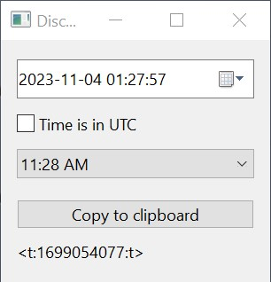

Discord Date Tool
=================

A tool for generating a magic tag that discord will display as a timestamp in
the viewer's timezone.

The program run with no flags will output the current timestamp in the "t"
format or "11:28 AM" (although the AM/PM vs. 24 hour format depends on the
user's locale)

This can be altered by adding flags, `-f` for changing the format and adding
the date to the command line in the format `YYYY-MM-DD hh:mm:ss`.

Usage
-----
```
Usage: discorddate [-f format] <date>

  -f string
        Rendering format (default "t")

Available formats:
         F Saturday, November 4, 2023 11:28:27 AM
         f 4 November 2023 11:28
         R in 2 hours
         D November 4, 2023
         d 04/11/2023
         T 11:28:27 AM
         t 11:28 AM
```

GUI
---

There is a gui version using [golang-ui](https://github.com/libui-ng/golang-ui)
 in the `cmd/discorddate-gui` directory.

Building
--------

To build all binaries, run
```
% go build -o . ./...
```

Build only console binary
```
% go build ./cmd/discorddate
```

Build only GUI binary
```
% go build ./cmd/discorddate-gui
```

MS Windows
----------

Building on windows without special options will yield working binaries, but in
order for the gui binary to run without also opening a text output window you
will need to add linker arguments to go build, and if you would like to see
the fancy icon and have author and version flags set in the binary you must
run go generate to build the binary resource files that then get embedded in
the binary:

```
% go generate ./...
% go build -ldflags -H=windowsgui ./cmd/discorddate-gui
```


Screenshot
----------


